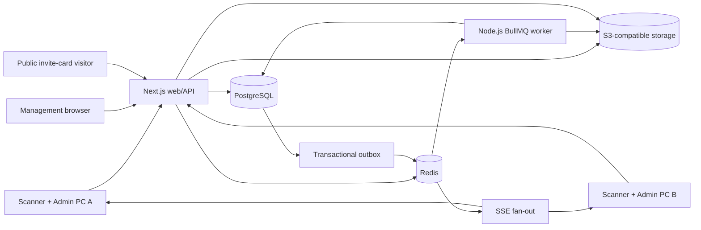
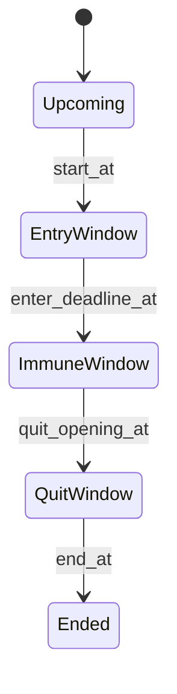

# EGM Guest Manager — complete rebuild prompt for Codex

> Version: 1.0  
> Target stack: Next.js + Node.js + PostgreSQL + Redis  
> Product language: Persian (RTL)  
> Business timezone: `Asia/Tehran`  
> Scope: only Event Guest Manager (EGM) guest operations

## How to use this document

Give this entire Markdown file to Codex as the implementation prompt. It is deliberately self-contained: a developer should be able to rebuild the guest-management subsystem without needing the old PHP implementation.

The words **MUST**, **MUST NOT**, **SHOULD**, and **MAY** describe product requirements. When a requirement and a proposed implementation detail conflict, preserve the requirement and choose the safest implementation.

---

# Prompt for Codex

You are rebuilding an existing production system called **EGM Guest Manager**. Build a production-ready, Persian RTL event guest-management application using Next.js, Node.js, PostgreSQL, and Redis. Preserve every workflow and business rule in this document, while replacing legacy implementation details with a normalized, reliable architecture.

Do not build a generic event demo. Implement the exact operational behavior specified here. The application is used live at event entrances by multiple administrators and multiple USB barcode/QR scanners, sometimes simultaneously, so correctness under concurrency is more important than cosmetic shortcuts.

## 1. Non-negotiable scope

Build only these capabilities:

- EGM event creation and settings needed by guest operations.
- Period/session creation, ordering, scheduling, ending, and attendance-record reset.
- Guest directory and organization-user source integration.
- Selecting/inviting guests into each period, including Excel import and matching.
- Viewing and editing the invited users of a period.
- Shared and period-specific invite-card design, generation, storage, links, and export.
- A public opaque invite-card link.
- The live Guest Control scanner page for entry, exit, force actions, and walk-ins.
- Live attendance statistics.
- Operational records, search, guest details, and audit history.
- Correct Presence / Fake Presence classification.
- Period-scoped Excel exports.
- Authentication, authorization, CSRF/origin protection, auditability, observability, tests, backup-safe persistence, and deployment support for this scope.

Do **not** implement or copy any of the following:

- tasks, missions, quizzes, quiz answers, information tasks, photo tasks, conditional quizzes, or task scores;
- prizes, rewards, pots, draws, or winners;
- teams, team challenges, team membership, or team scoring;
- participant passwords, participant login progress, task completion, roll counts, or mission monitoring;
- RateMe, TaskClub, or any unrelated mini-app;
- legacy CSV or local JSON data stores;
- local-server folders as a source of truth.

If legacy screens contain task-oriented tabs such as Information, Prizes, Monitoring, Team, Score, or Quiz, omit them. A simple optional `notes` field on an event or period is acceptable, but it must not become a task/content engine.

## 2. Product vocabulary

| Term | Meaning |
|---|---|
| EGM / Event | One event container, for example `رویداد مسیر صعود ۱۴۰۵`, with a stable code such as `0002`. |
| Period | One event day/session/window, for example `روز اول`, with a stable code such as `001`. |
| Organization user / OEU | A person from the organization-wide employee/user directory. This is an upstream source, not attendance itself. |
| Custom guest | A guest stored only inside this EGM and not added to the organization directory. |
| Genuine invitation | A normal invitation to a period, sourced from OEU or the EGM custom directory. |
| Other-period guest | A person admitted to the active period who has a genuine invitation in another period but not this one. |
| Walk-in | A person admitted to the active period who has no genuine invitation in any period of the event. |
| Attendance | The period-specific entry/exit state for a guest. |
| Correct Presence | A valid attendance classification. UI label: `حضور واقعی`. |
| Fake Presence | An unreasonable/forced attendance classification. UI label: `حضوری نامعقول`. |
| Guest number | A stable, event-local, sequential number shown as at least four digits. It is never reused or silently changed. |
| Invite-card code | A high-entropy opaque public code that resolves to one generated card. |

## 3. Product principles

1. PostgreSQL is the source of truth for events, periods, guests, invitations, attendance, links, and audit metadata.
2. Redis is never the source of truth for attendance. Use it for queues, fan-out, rate limits, ephemeral idempotency hints, and cache invalidation.
3. Store binary assets in S3-compatible object storage. Store their keys, hashes, dimensions, MIME types, byte counts, and lifecycle state in PostgreSQL. Do not depend on a local web-server path. If object storage is absolutely unavailable, use PostgreSQL `bytea`; never use base64 blobs in JSON.
4. Every scan attempt is recorded, including rejected, duplicate, and forced attempts.
5. A scan must never be lost because another scan is being processed.
6. Two PCs scanning the same person concurrently must not create two entries or corrupt timestamps.
7. All admin screens are Persian, RTL, responsive, keyboard accessible, and usable on a busy event desk.
8. All API errors return valid JSON with a stable error code. Reverse-proxy error pages must never be mistaken for JSON.
9. Store instants in UTC as `timestamptz`. Render operational times in `Asia/Tehran`. Use the Persian calendar only for display and filenames; never store Jalali strings as canonical timestamps.
10. Do not destroy guest lists, invitations, cards, or period settings when resetting attendance records.

## 4. Recommended target stack

Use current stable, mutually compatible versions at implementation time:

- Next.js App Router with TypeScript in strict mode.
- Node.js runtime for all database, upload, export, and scanner endpoints; do not use Edge runtime for them.
- React Server Components for initial reads and client components only where interaction is required.
- PostgreSQL 16 or newer.
- Prisma or Drizzle for ordinary queries and migrations. Use explicit SQL transactions and `SELECT ... FOR UPDATE` for attendance concurrency.
- Redis 7 or newer.
- BullMQ workers for durable card generation, import processing, and large XLSX exports.
- Server-Sent Events (SSE) for one-way live dashboard updates. WebSocket is acceptable only if a genuine two-way realtime need is added. Keep a version-polling fallback.
- Zod for request and environment validation.
- React Hook Form for larger forms.
- Tailwind CSS or CSS Modules plus accessible headless primitives such as Radix UI. Keep the final visual language calm and custom; do not ship a default component-library appearance.
- ExcelJS or another library that creates a real Office Open XML `.xlsx` ZIP package.
- SheetJS or ExcelJS for reading `.xlsx`/`.xls`; a streaming CSV parser for CSV.
- `@napi-rs/canvas` or an SVG composition pipeline plus `sharp` for server-side card rendering; a proven QR library for QR generation.
- An S3-compatible service such as S3, R2, or MinIO.
- Pino structured logging. OpenTelemetry and Sentry are recommended.
- Vitest for units, integration tests against real PostgreSQL/Redis containers, and Playwright for end-to-end UI tests.

Suggested deployment processes:

```text
web       Next.js application
worker    BullMQ import/card/export workers
postgres  durable relational state
redis     queues, events, cache, rate limits
objects   card backgrounds, fonts, generated cards, temporary imports/exports
```

## 5. Architecture



Use a transactional outbox or publish-after-commit mechanism. Realtime notifications may be retried or duplicated, so clients must treat them as invalidation signals and fetch canonical PostgreSQL state.

## 6. Roles and permissions

At minimum implement:

| Permission | Capabilities |
|---|---|
| `egm.view` | View event and periods. |
| `egm.manage` | Edit event-level settings and shared invite-card template. |
| `egm.periods.manage` | Create, reorder, edit, end, and remove periods. |
| `egm.invites.manage` | Select/import guests, edit period invitees, remove invitations. |
| `egm.cards.manage` | Configure, generate, regenerate, and export card links. |
| `egm.control.use` | Open Guest Control, scan, search records, and view guest details. |
| `egm.control.force` | Force Enter / Force Quit. |
| `egm.walkins.manage` | Register a walk-in or other-period admission. |
| `egm.attendance.edit` | Manually edit period-specific attendance and presence classification. |
| `egm.attendance.reset` | Reset period attendance records after typed confirmation. |
| `egm.exports.download` | Download period exports. |
| `egm.audit.view` | View full audit history, IP, actor, and request metadata. |

Permissions are server-enforced. Hiding a button is not authorization. Every mutation records actor ID, time, request ID, IP, and user agent.

## 7. Navigation and routes

Recommended admin routes:

```text
/admin/egm                                  event list
/admin/egm/[eventCode]                      event overview
/admin/egm/[eventCode]/guests               EGM guest directory/source
/admin/egm/[eventCode]/invite-card          shared card template
/admin/egm/[eventCode]/periods              period list/create/reorder
/admin/egm/[eventCode]/periods/[periodCode]  selected period
  ?tab=control                              period configuration
  ?tab=invite                               candidate filters + Excel selection
  ?tab=invitees                             invited-list editor
  ?tab=card                                 period background + card generation
  ?tab=exports                              period exports
/admin/egm/[eventCode]/guest-control         live scanner dashboard
/admin/egm/[eventCode]/audit                 system audit view
/Invited/[inviteCode]                        public generated invite card
```

The selected event header must always use the event record addressed by the URL. Never hardcode the developer EGM name or code. The page heading, permissions, period list, guests, cards, and APIs must all resolve from the same event ID/code.

## 8. Visual language and responsive rules

- Set `<html lang="fa" dir="rtl">`.
- Use a Persian-capable font with clear Persian digits and Latin code rendering.
- Use logical CSS properties (`margin-inline`, `border-inline-start`) rather than hardcoded left/right when possible.
- Main surfaces are white or very light neutral, with low-contrast borders and subtle shadows.
- Status colors:
  - green: accepted entry/exit and completed action;
  - amber: duplicate, prior-period warning, or attention state;
  - red: rejected, invalid, or unsafe action;
  - blue/neutral: informational or pending.
- Do not encode state with color alone. Always add text, icon/dot, and suitable ARIA labels.
- Avoid horizontally scrollable attendance records. On wide screens use a five-column card-table. On small screens stack the same fields inside each card.
- Records must feel separated without wasting vertical space: subtle outer border, alternating neutral surface if useful, colored inline status rail, dashed detail divider, and a small gap between cards.
- Use skeletons for slow subpanes and lazy-load each subtab only when opened. Never block the full event panel while card assets or large invite lists load.
- Keep scanner-critical controls above the fold on common 1366×768 screens.

## 9. Event shell

The event overview must show:

- event name;
- stable event code;
- active/inactive state;
- shortcut to Guest Control;
- period count and currently active period;
- shortcuts to Guests, Shared Invite Card, Periods, and Audit;
- clear environment badge in development/test environments, never derived from a hardcoded event code.

Do not show task, prize, scoring, team, or quiz navigation.

## 10. Period management

### 10.1 Period list

The period-management page contains:

- `نام بازه` input;
- `افزودن بازه` button;
- a list/table containing order, name, stable period code, current status, and actions;
- move up/down or drag reorder with an accessible keyboard alternative;
- open/edit and remove actions.

Generate a stable, zero-padded period code per event, normally `001`, `002`, and so on. Never reuse a removed code if that could collide with historical exports, logs, or public links.

Removing a period is destructive. Prefer archive/soft-delete when attendance, logs, generated cards, or exports exist. If true deletion is supported, require a strongly worded confirmation and transactionally remove only the selected period’s dependent records/assets.

### 10.2 Period tabs

Only these guest-management tabs belong in the target:

1. `کنترل` — settings, status, end, reset, Guest Control shortcut.
2. `دعوت` — filters, selection, Excel matching.
3. `دعوت‌شدگان` — current period invited-list and editor.
4. `Invite Card` — period background and generation.
5. `خروجی` — Excel exports.

### 10.3 Period control form

Fields and controls:

| Field | Type | Rule |
|---|---|---|
| Period title | text | Required. |
| Active | switch | An inactive period cannot accept scans. |
| Scheduled | switch | When on, start/end are required. |
| Quit Required | switch | When on, Scheduled is required. |
| `الزام مهلت ورود و آغاز خروج` | switch | Visible/enabled only when Quit Required is on. Controls strict vs flexible quit mode. |
| Minimum stay | dropdown | Used only for flexible quit mode; 1–1440 minutes. |
| Test/development mode | switch | Clearly marked; never changes event identity. |
| Start | Gregorian date + time | Required when Scheduled. |
| Entry deadline | Gregorian date + time | Required only in strict quit timeline. |
| Quit opening | Gregorian date + time | Required only in strict quit timeline. |
| End | Gregorian date + time | Required when Scheduled. |

Minimum-stay dropdown values should be convenient rather than 1,440 raw rows:

- every minute from 1 through 60;
- every 15 minutes from 75 through 180;
- every 30 minutes from 210 through 360;
- every hour from 420 through 1,440;
- include the currently saved custom value if it is valid.

Validation:

- If Scheduled is on: `start_at < end_at`.
- If Quit Required is on, Scheduled must be on.
- If Quit Required and strict timeline are on: `start_at < enter_deadline_at < quit_opening_at < end_at`.
- If strict timeline is off, entry-deadline and quit-opening are optional and must be persisted as `NULL`. The server must never return `همه تاریخ‌ها و ساعت‌های خط زمانی ورود و خروج الزامی هستند.` for this mode.
- A stale client that submits strict timeline as on while all four optional controls are empty should be interpreted as flexible mode, not rejected.
- Once a period is manually ended, ordinary settings cannot silently reactivate it. Provide an explicit privileged reopen operation if reopening is desired.

The control tab also shows:

- a status/phase badge;
- `باز کردن صفحه کنترل مهمان`;
- `ذخیره`;
- `پایان بازه`;
- `بازنشانی سوابق این بازه` only for authorized users and only inside period settings.

Never place the attendance-reset action on the live Guest Control scanner screen.

### 10.4 Derived period status

The backend returns one stable status code plus Persian label:

| Code | Meaning |
|---|---|
| `inactive` | Period switch is off. |
| `upcoming` | Scheduled and current time is before start. |
| `entry_time` | Strict quit period: start through entry deadline. |
| `immune_time` | Strict quit period: after entry deadline and before quit opening; scans are rejected. |
| `quit_time` | Strict quit period: quit opening through end. |
| `flexible_attendance` | Quit required with no deadline/opening; scan toggles entry then exit subject to minimum stay/quit wave. |
| `active_unscheduled` | Active entry-only period without scheduling, if this mode is intentionally allowed. |
| `ended` | End time passed or period was manually ended. |
| `invalid_schedule` | Required timestamps are absent or out of order. |

At most one period may be operationally active. If multiple periods overlap, scanner processing returns `multiple_active_periods`; it must not guess.

### 10.5 End Period

`پایان بازه` opens a confirmation dialog explaining how to handle guests who have an entry but no exit. Require one selection:

- classify them as `حضور واقعی` / `correct_presence`; or
- classify them as `حضوری نامعقول` / `fake_presence`.

Run the operation transactionally:

1. Lock the period row.
2. If already ended with the same resolution, return success with `alreadyEnded: true` and do nothing else.
3. If already ended with a different resolution, return HTTP `409` and preserve the original decision.
4. Select and lock only this period’s attendance rows with `entered_at IS NOT NULL`, `quit_at IS NULL`, and no existing correct/fake classification.
5. Apply the selected classification, keeping the two flags mutually exclusive.
6. Do not fabricate an exit timestamp and do not change the physical attendance state from `entered`.
7. Store `ended_at`, `ended_by`, `ended_no_quit_resolution`, and classified count.
8. Set the period inactive.
9. Write audit/outbox rows in the same transaction.

If any part fails, no partial classification or period-state change may remain.

### 10.6 Reset attendance

`بازنشانی سوابق این بازه` requires `egm.attendance.reset` and typed confirmation such as `RESET_PERIOD_ATTENDANCE`.

For the selected period, reset only:

- `entered_at`;
- `quit_at`;
- `attendance_state` to `not_entered`;
- `correct_presence` and `fake_presence` to false;
- last control condition/action/message/time;
- period-scoped attendance attempts/control logs, or mark them as reset according to the audit retention policy.

Preserve:

- the event and period;
- period settings and dates;
- all guest profiles;
- OEU links;
- invitations and invitation source;
- guest numbers;
- shared and period card settings;
- invite-card codes, public links, and generated assets;
- unrelated periods;
- security audit of who initiated the reset.

A full-all-period attendance reset MAY exist as a highly restricted maintenance operation, but it must never appear in Guest Control and must use a different typed confirmation such as `RESET_ALL_ATTENDANCE`.

## 11. Guest directory and source

An EGM has one active invitation-source preference:

- `OEU` / organization directory;
- `Custom` / EGM-only guest directory.

This preference changes the candidate list; it does not delete or convert existing guests/invitations.

Store a normalized event guest profile with:

- first name;
- last name;
- national ID, nullable;
- work/personnel ID, nullable;
- phone number;
- stable event guest number;
- deputy;
- general department;
- department;
- gender (`male`, `female`, `unspecified` plus optional extensibility);
- postal level/grade;
- active flag;
- outside-organization flag;
- source type (`oeu`, `custom`, `walk_in`);
- nullable OEU source-user ID;
- created/updated timestamps and actor IDs.

Identity rules:

- Normalize Persian and Arabic digits to ASCII before validation or comparison.
- A national ID is exactly 10 digits. Preserve leading zeroes by storing it as text.
- A work ID is 4–9 digits. Preserve leading zeroes by storing it as text.
- At least one valid identity is required for a normal invite/card.
- National ID uniqueness is enforced per event for non-null values.
- Resolve work-ID duplicate policy explicitly. If work IDs are unique in the organization, enforce event-level uniqueness; otherwise reject ambiguous matches instead of choosing the first record.
- A guest number is assigned once using an event-scoped sequence under a lock, formatted with at least four digits, and never reused.

When an OEU-sourced guest is edited inside EGM, profile changes that belong to OEU must update the upstream OEU record through a transactional integration service. Custom unmatched guests must never be inserted into OEU.

## 12. Period invitation workflow

### 12.1 Candidate filters

Show a calm filter card with:

- free search over name, national ID, and work ID;
- deputy;
- general department;
- department;
- gender;
- postal level;
- `اعمال فیلتر` and `پاک کردن`.

Candidate table columns:

- checkbox;
- guest number;
- first name;
- last name;
- national ID;
- work ID;
- deputy;
- general department;
- department;
- gender;
- postal level;
- current invitation status.

Use server-side paging with a default page size of 50. Support select visible, select all matching (with an explicit total), and invite selected. Inviting is idempotent: an existing period invitation is not duplicated.

### 12.2 Excel selection/import

Accept `.xlsx`, `.xls`, and `.csv`. Do not trust the extension; inspect MIME/signature and enforce configurable row/file limits. For workbooks:

1. show sheet names;
2. let the admin choose the sheet;
3. treat the first non-empty row as headers;
4. preview rows before mutation;
5. provide mapping dropdowns for national ID, work ID, first name, last name, phone, deputy, general department, department, gender, and postal level;
6. require national ID or work ID mapping;
7. automatically preselect the most likely columns.

Auto-mapping normalization:

1. Unicode NFKC;
2. lowercase Latin;
3. remove Arabic diacritics, tatweel, bidi marks, zero-width characters, and surrounding whitespace;
4. normalize Arabic/Persian letters:
   - `ي`, `ى`, `ئ` → `ی`;
   - `ك`, `ڪ` → `ک`;
   - `ة`, `ۀ` → `ه`;
   - `ؤ` → `و`;
   - `إ`, `أ`, `آ`, `ٱ` → `ا`;
5. normalize Persian/Arabic digits to ASCII;
6. remove punctuation and collapse spaces;
7. score exact alias match first, then contains match, then Levenshtein/Jaro-Winkler similarity;
8. fuzzy matching should require a reasonable length ratio (about `0.55`) and score (about `0.72`) so `نام` is not incorrectly assigned to `نام خانوادگی`.

Aliases must include at least:

| Target | Common aliases |
|---|---|
| National ID | `national id`, `nationalid`, `کد ملی` |
| Work ID | `work id`, `workid`, `personnel id`, `کد پرسنلی`, `شماره پرسنلی` |
| First name | `first name`, `firstname`, `نام` |
| Last name | `last name`, `lastname`, `family`, `surname`, `نام خانوادگی` |
| Phone | `phone number`, `phone`, `mobile`, `شماره همراه`, `شماره موبایل`, `تلفن همراه`, `موبایل` |
| Deputy | `deputy`, `معاونت` |
| General department | `general department`, `اداره کل` |
| Department | `department`, `اداره` |
| Gender | `gender`, `جنسیت` |
| Postal level | `postal level`, `postal grade`, `سطح پستی` |

### 12.3 Matching rules

For each normalized import row:

1. Match a valid national ID when present.
2. Otherwise match a valid work ID.
3. If both identifiers resolve to different people, mark `identity_conflict`; never merge automatically.
4. If matched by work ID and Excel contains a valid national ID while both OEU and EGM national ID are blank, update both OEU and the linked EGM guest.
5. If a different national ID is already present, do not overwrite it. Mark a conflict for manual resolution.
6. A valid work-ID-only OEU guest is inviteable and later uses work ID in the card QR.
7. Return matched, unmatched-but-inviteable, uninviteable, duplicate-import, and conflict rows separately.

The preview must show why each row is in its category. The admin may select unmatched-but-inviteable rows and add them only to the EGM custom guest directory, then invite them to the current period. Never add these rows to OEU.

Rows without either a valid 10-digit national ID or a valid 4–9-digit work ID are uninviteable. Add an `Export Uninviteable` button that downloads a real `.xlsx` containing exactly:

- full name;
- phone number.

### 12.4 Import reliability

- Parse large files in a BullMQ job, with progress and resumable status.
- Store a file hash and import idempotency key so a retry does not invite twice.
- Persist import summary, mappings, row errors, actor, and timestamps for audit.
- Reject formulas/macros/external links or treat cell display values as inert text. Never execute workbook content.
- Return validation failures as JSON, even if the semantic code is 422.

## 13. Invited users tab

Show total, search, refresh, paging, and these columns:

- guest number;
- first name;
- last name;
- national ID;
- work ID;
- phone;
- organization fields;
- gender;
- postal level;
- Correct Presence;
- Fake Presence;
- invitation source;
- Operations.

The Operations column contains Edit and Remove Invitation.

### 13.1 Edit invited guest dialog

The dialog edits:

- first/last name;
- national ID;
- work ID;
- phone;
- guest number only if a dedicated permission allows it; normally read-only;
- organization fields;
- gender;
- postal level;
- active, outside-organization, and walk-in flags;
- attendance state: not entered, entered, quit completed;
- entry timestamp;
- exit timestamp;
- presence classification: none, Correct Presence, Fake Presence.

Rules:

- Profile changes affect the guest in all periods of this EGM.
- Attendance changes affect only the selected period.
- OEU-sourced profile changes synchronize to OEU; custom guests remain EGM-only.
- Duplicate national IDs are rejected.
- `not_entered` clears entry/exit timestamps and both presence flags.
- `entered` requires entry and clears exit.
- `quit_completed` requires both entry and exit with exit after entry.
- Correct and Fake Presence are mutually exclusive.
- Manual changes write an audit attempt with condition `manual_edit`, before/after JSON, and actor.

Removing an invitation removes only the selected period relationship and its period-specific card route/asset when safe. It does not delete the event guest profile. If attendance exists, block removal or require a dedicated audited archival workflow.

## 14. Shared invite-card template

The shared template belongs to one event and supplies every period unless that period has a background override.

### 14.1 Background and selection tool

- Accept PNG, JPEG, and WebP after decoding/validation.
- Display filename, size, pixel dimensions, and preview.
- Open a Selection Tool modal.
- Let the admin choose `QR` or `Invite Text Area`, then drag/resize a rectangle over the image.
- Provide Clear Current, Confirm, and Cancel.
- Store rectangle coordinates as percentages (`x`, `y`, `width`, `height` in `0..1`) so generation uses full source resolution.
- Validate nonzero bounds entirely inside the image.

### 14.2 Rich invite text

Provide a focused content editor with:

- bold (`Ctrl+B`);
- unordered list (`Ctrl+L`);
- ordered list;
- remove formatting;
- selected-text color and reset/default color;
- RTL editing and Persian-friendly line height.

Allowed merge fields:

```text
[fullname]
[firstname]
[lastname]
[nationalid]
[workid]
[guestnumber]
[phonenumber]
[deputy]
[generaldepartment]
[department]
[gender]
[postallevel]
```

Do not include score/task variables.

Sanitize saved HTML with a strict allowlist. Do not allow script, event handlers, remote images, iframes, or arbitrary CSS.

### 14.3 Font

- Accept TTF, OTF, WOFF, and WOFF2 up to 6 MB.
- Verify the binary signature and parseability.
- Allow remove/reset to default.
- Embed/use the stored font in server-side card rendering.

### 14.4 Conditional variables

Let administrators create custom tokens such as `[code]`:

- token names contain only ASCII letters, digits, and underscore;
- choose one guest field as input;
- add ordered If / Else If rules with operator, value, and replacement text;
- add an Else fallback;
- support save, save-and-insert, edit, reset, and delete;
- maximum 20 conditions per variable and 50 variables per template;
- persist an unfinished builder draft/autosave separately from the saved variable.

Support safe operators such as equals, not equals, contains, starts with, ends with, is empty, and is not empty. Normalize Arabic/Persian text before comparisons where appropriate.

### 14.5 Save and Test Generate

- Explicit Save plus debounced autosave after initial load.
- Test Generate requires selecting one event guest via search.
- Use the period override background when testing from a period, otherwise shared background.
- QR data is the valid 10-digit national ID; if absent, use the valid 4–9-digit work ID.
- UI help must state this fallback. Do not claim the QR is always national ID.
- Generate a real full-resolution PNG preview and download.
- QR settings equivalent to 1024 logical size, margin 2, ECC M.
- Enforce a maximum source/output area around 40 million pixels and configurable byte limits.
- Render Persian shaping, RTL alignment, custom font, lists, colors, merge fields, and conditional variables correctly.

## 15. Period invite-card generation

Each period has an Invite Card tab containing:

- current background source indicator: Shared or Period Override;
- upload/save/remove period background override;
- template readiness validation;
- invitee identity validation;
- Generate All;
- Regenerate All;
- durable job progress with total, generated, failed, pending, and percent;
- retry failed;
- export generated links.

Before generation:

1. Load genuine and admitted invitees for the period.
2. Attempt safe OEU enrichment for missing national IDs.
3. For each guest select QR identity: national ID if valid, else work ID if valid.
4. If neither is valid, do not start a partial batch silently. Show the invalid count and representative names and link to the invited-list editor.

Generation must run in BullMQ workers, not inside the browser tab. Closing the tab must not stop it. The UI reconnects to job progress after reload.

For each period guest:

- create a high-entropy opaque invite code once;
- include event and period codes only if desired for support, but randomness must be sufficient by itself;
- preserve the code and public URL during regeneration;
- replace only the generated asset and generation metadata;
- render a JPEG or PNG according to configured quality;
- upload atomically to object storage;
- update the database route to `generated` only after object upload succeeds;
- record content hash, template version, background version, generated timestamp, and error if any.

Jobs must be idempotent. A retry must not generate a second public code or publish a half-written object.

### 15.1 Public card route

`/Invited/[inviteCode]` is public and requires no guest login.

- Validate the path as one opaque token; reject extra path segments.
- Unknown, pending, failed, deleted, or missing-asset codes return a normal branded 404.
- Generated codes return the image directly or redirect to a versioned object/CDN URL.
- Add `Cache-Control` suitable for versioned immutable assets; route status lookups should not leak guest data.
- Do not expose national ID, work ID, event code, database ID, or storage key in error responses.
- Prevent directory traversal and open redirects.

### 15.2 Card link export

Download a real `.xlsx` with:

- full name;
- national ID;
- work ID;
- phone;
- invite-card URL as both text and clickable hyperlink.

Preserve leading zeroes by explicitly writing identity/phone cells as strings. Export only generated routes. Regeneration must leave these URLs unchanged.

## 16. Guest Control scanner page

This is the most operationally critical screen.

### 16.1 Desktop wireframe

```text
┌──────────────────────────────────────────────────────────────────────────┐
│ پنل کنترل مهمان       Event name / Active period       [Phase badge]   │
├──────────────────────────────────────────────────────────────────────────┤
│  67 از 85 دعوت‌شده  [██████████████░░] 78.8%                           │
│  دعوت همین بازه 65 · دعوت بازه دیگر 2 · بدون دعوت 0                    │
│  در انتظار 20     اکنون داخل 44     خروج ثبت‌شده 23                    │
│  آقایان 40/50  ─────  بانوان 27/35 ─────  نامشخص 0/0                  │
├──────────────────────────────────────────────────────────────────────────┤
│ شناسه ملی / پرسنلی                                                    │
│ [                  scanner input                  ]  queue: 0           │
│ [latest result message]                                                │
├──────────────────────────────────────────────────────────────────────────┤
│ جستجو در همه گزارش‌ها [.................................]  ۸ نتیجه     │
│ ┌ Status │ Guest │ Latest operation │ Attendance │ Operations ┐         │
│ │ each result is a separated compact card with colored status rail │    │
│ └ message · period · checked time ─────────────────────────────┘         │
└──────────────────────────────────────────────────────────────────────────┘

Top-left viewport: stacked scan-result toasts (maximum four).
```

### 16.2 Header and active period

Show:

- eyebrow `پنل کنترل مهمان`;
- event name;
- active period title;
- phase/status badge;
- no unrelated navigation or reset buttons.

If there is no active period, disable the scanner and show the closest previous and next period, including title and scheduled time. If periods overlap, show a red configuration error and disable scanning.

### 16.3 Scanner field

- Label: national/work identifier.
- Numeric input, `inputmode="numeric"`, autocomplete off, maximum 10 digits.
- Autofocus on load and after every request, dialog close, and visibility return.
- Ten digits submit immediately.
- Manual 4–9 digits submit on Enter.
- A hardware-scanner burst of 4–9 digits auto-submits about 90 ms after its last character.
- Normalize Persian/Arabic digits and strip non-digits.
- Never accept fewer than 4 or more than 10 digits.
- Show a small queue count while requests are pending.

Hardware-scanner detection baseline:

- maximum gap between numeric key events: 50 ms;
- require at least three consecutive fast gaps;
- completion delay: about 90 ms;
- reset detection on a slow gap, repeat key, or unrelated ordinary key.

### 16.4 Page-level scanner capture

When scanner focus is accidentally elsewhere, the page must recognize a rapid numeric scanner burst and redirect it to the scanner field.

- Listen in capture phase on `document`.
- Ignore the real scanner input, disabled state, open dialogs, composition, repeated keys, and Ctrl/Meta/Alt combinations.
- Snapshot the original input/textarea/select/contenteditable value and selection before the burst.
- Once scanner speed is confidently detected, prevent/stop subsequent scanner keystrokes, restore the original control, focus the scanner input, and transfer the captured identifier.
- Add a short visual focus pulse so the operator knows capture succeeded.
- Never steal ordinary slow typing.
- Do not capture while an edit or walk-in dialog is open.

### 16.5 Browser FIFO queue

FIFO means First In, First Out; it is a queue behavior, not a separate product. Implement it in the scanner client:

1. On valid scan, immediately copy the normalized identifier into an in-memory queue.
2. Clear and refocus the field immediately so the next scanner can type without waiting.
3. If no request is active, process the head.
4. Await its response, display feedback, then process the next item.
5. Continue after a failed request; one failure must not discard later scans.
6. Disable conflicting force/walk-in submission while the relevant mutation is active, but keep accepting scan bursts into the queue.
7. Add a client-generated UUID idempotency key to every scan.

The browser FIFO prevents loss on one PC. PostgreSQL locking and idempotency provide correctness across multiple PCs.

## 17. Scan identity and active-period resolution

### 17.1 Identifier lookup

- Ten digits: look up by normalized national ID.
- Four through nine digits: look up by normalized work ID.
- Reject ambiguity. Never choose an arbitrary guest when duplicate work IDs exist.
- Guest must be active.

### 17.2 Active period

Resolve the operational period on the server using `Asia/Tehran` business rules and locked database state. Do not trust a period ID supplied by the scanner browser.

- no candidate → `no_active_period`;
- more than one candidate → `multiple_active_periods`;
- manual end → `ended`;
- invalid timestamps → `invalid_schedule`.

Return previous/next period metadata for a no-active-period UI.

### 17.3 Invitation check

The person must have a current-period row to scan normally.

- Invited to current period: continue.
- Not invited to current, but genuinely invited to another period: return `invited_other_period` with the other period title and offer authorized walk-in/admit action.
- Has recorded attendance in a previous period: return/show `attended_previous_period` warning with period name and guest category. If also genuinely invited to the current period, the valid current entry may still succeed, but include a separate warning toast.
- Exists in EGM but no invitation: `not_invited`.
- Not found: `not_found`.

## 18. Attendance state machine

Canonical states:

```text
not_entered  --valid entry--> entered --valid exit--> quit_completed
```

Legacy/inconsistent data may be represented as `invalid_quit_without_entry`, but normal code must never create it.

### 18.1 Entry-only period

When `quit_required = false`:

- a valid first scan in the active window records `entered_at` and returns `success`;
- another scan returns `duplicate` and preserves the original timestamp;
- no exit action is offered;
- ordinary entry alone may be treated as the event’s valid physical attendance, but keep Correct/Fake classification logic explicit rather than changing it accidentally.

### 18.2 Strict quit timeline

When quit is required and `quit_timeline_required = true`:



- Entry window: first scan enters; duplicates warn.
- Immune window: reject all automatic attendance mutations as `immune_time`.
- Quit window: an entered guest exits; already-exited returns `quit_duplicate`; no-entry returns `quit_without_entry`.
- After end: `ended`.

### 18.3 Flexible quit timeline

When quit is required and `quit_timeline_required = false`:

- only start and end are required;
- first scan records entry;
- next scan records exit only after the configured minimum stay;
- if too early, return `minimum_stay` plus rounded remaining minutes and preserve entry;
- an exited guest’s later scans return `quit_duplicate` and preserve timestamps.

Quit wave:

```text
quit_wave_active = invited_users > 0
                   AND completed_quits > 0
                   AND completed_quits * 100 > invited_users * 20
```

The threshold is strictly greater than 20%; exactly 20% does not activate it. Once active:

- guests with no entry cannot enter (`entry_closed_quit_wave`);
- guests already inside may exit immediately, ignoring minimum stay;
- completed exits remain duplicates.

Use the current period’s eligible/invited population consistently for the denominator. Walk-in rows must not silently inflate the genuine invited count.

### 18.4 Force actions

Force actions appear only in each record card’s Operations column, never as a global button above the logs.

- `Force Enter`: available when a resolvable period guest lacks entry and an authorized operator needs to override normal rejection.
- `Force Quit`: available only when quit is required, entry exists, and exit is absent.
- Require confirmation that the action marks Fake Presence.
- Force actions set `fake_presence = true`, `correct_presence = false`.
- Store forced entry/exit timestamp and actor.
- Return `force_entry_success` or `force_quit_success`.
- Do not allow Force Quit in an entry-only period.

### 18.5 Correct/Fake classification

- A normal valid entry and valid exit can set Correct Presence, provided the record was never forced/fake.
- A forced action sets Fake Presence.
- Manual end resolution can classify unresolved entered/no-exit rows without inventing exit time.
- Manual invited-list editor can set none/correct/fake with validation.
- Flags are mutually exclusive through a database check constraint.
- Do not show presence type as a crowded column on the main live records view. Show it in guest details and the invited-list management/export views.

## 19. Transactional scan algorithm

Implement a single database transaction per scan/force action. Pseudocode:

```text
BEGIN;

1. Insert or look up idempotency record by (event_id, idempotency_key).
   If completed, return its stored response.

2. Resolve and lock the active period row.
   Reject no/multiple/ended/invalid states safely.

3. Resolve the guest identity.

4. SELECT period_invite ... FOR UPDATE for this guest + active period.

5. Re-read attendance fields under the lock.

6. Apply the state machine with one conditional UPDATE, e.g.
   UPDATE period_invites
      SET entered_at = now(), attendance_state = 'entered'
    WHERE id = $id AND entered_at IS NULL;

7. Insert attendance_attempt containing success/rejection, action,
   message, snapshots, actor/device/request metadata.

8. Insert outbox event and store final idempotent response.

COMMIT;
```

For a rejected scan where no guest row can be locked, still record the attempt transactionally with normalized scanned identifier. A database timeout must return a retryable code; the client keeps queue order and can retry with the same idempotency key.

Do not use a long MySQL-style user lock name or a Redis mutex as the primary correctness control. PostgreSQL row locks, constraints, and idempotent conditional updates are authoritative.

## 20. Result codes, copy, and feedback tone

Use stable machine codes. Persian text may be refined, but meaning must remain:

| Code | Persian label | Tone |
|---|---|---|
| `success` | ورود موفق | green |
| `quit_success` | خروج موفق | green |
| `force_entry_success` | ورود اجباری | green action, visibly marked fake |
| `force_quit_success` | خروج اجباری | green action, visibly marked fake |
| `walk_in_registered` | مهمان ناخوانده ثبت شد | green |
| `duplicate` | قبلاً وارد شده | amber |
| `quit_duplicate` | قبلاً خارج شده | amber |
| `attended_previous_period` | حضور در بازه قبلی | amber |
| `minimum_stay` | حداقل مدت حضور کامل نشده | red/amber rejection |
| `entry_closed_quit_wave` | ورود به‌دلیل موج خروج بسته است | red |
| `quit_without_entry` | ورود ثبت نشده | red |
| `invalid_attendance_record` | سابقه حضور ناسازگار | red |
| `invited_other_period` | دعوت در بازه دیگر | red with admit action |
| `not_invited` | دعوت نشده | red with walk-in action |
| `not_found` | یافت نشد | red with registration action |
| `user_inactive` | مهمان غیرفعال | red |
| `no_active_period` | بدون بازه فعال | red |
| `multiple_active_periods` | هم‌پوشانی بازه‌ها | red |
| `upcoming` | در انتظار شروع | red/neutral |
| `immune_time` | زمان ایمن | red/neutral |
| `ended` | پایان‌یافته | red/neutral |
| `inactive` | غیرفعال | red/neutral |
| `invalid_schedule` | زمان‌بندی نامعتبر | red |
| `request_error` | خطای ارتباط/پردازش | red |

Every response includes:

```ts
type ScanResponse = {
  ok: boolean;
  result: string;
  message: string;
  requestId: string;
  guest?: { id: string; fullName: string; nationalIdMasked?: string; workId?: string };
  period?: { id: string; code: string; title: string; phase: string };
  attendance?: { state: string; enteredAt: string | null; quitAt: string | null };
  previousAttendance?: { periodCode: string; periodTitle: string; guestType: string; message: string };
  retryable?: boolean;
  stateVersion?: string;
};
```

## 21. Toast and sound feedback

For every scan result, show a top-left toast for about four seconds:

- maximum four visible toasts;
- status-colored border/background/dot;
- result title;
- guest full name or scanned identifier;
- one short message;
- animated progress line;
- gentle enter and leave transitions;
- ARIA live role (`status` for success, `alert` for rejection).

Previous-period warnings stay about six seconds and are amber.

Use Web Audio so no external sound file is required:

- success: quiet rising two-note sine, approximately 620 Hz then 880 Hz;
- failure: quiet falling two-note triangle, approximately 270 Hz then 175 Hz;
- unlock/resume the audio context on first pointer/keyboard/scanner interaction;
- respect an operator mute switch persisted per browser;
- sound is supplemental, never the only feedback.

## 22. Live statistics card

Use one compact statistics card; do not create a separate walk-in card.

Main line:

```text
{entered_all} از {genuinely_invited_current_period} نفر دعوت‌شده
```

Definitions:

- `invited_total`: only genuine current-period invitations. Walk-in admission rows never increase it.
- `entered`: everyone with entry in the active period, including current invitees, other-period guests, and pure walk-ins.
- `invited_entered`: entered guests genuinely invited to the current period.
- `other_period_entered`: entered as an admission/walk-in in this period, but has a genuine invitation in at least one different period of the same event.
- `walk_in_entered`: entered as an admission/walk-in in this period and has no genuine invitation in any event period.
- `waiting`: `max(invited_total - invited_entered, 0)`.
- `inside`: entered and no exit.
- `quit`: exit recorded.
- `entry_percent`: `entered / invited_total * 100`; show the exact number even over 100, but visually clamp the progress bar to 100%.

The three entered categories are mutually exclusive and must sum exactly to `entered`:

```text
entered = invited_entered + other_period_entered + walk_in_entered
```

Classification is period-scoped. Never use a historical event-guest `is_walk_in` flag alone. The current period invitation/admission row is authoritative, then inspect genuine invitations in other periods.

Show in the same card:

- tiny breakdown: `دعوت همین بازه`, `دعوت بازه دیگر`, `بدون دعوت`;
- waiting;
- currently inside;
- exited;
- male, female, and unspecified entered/eligible totals with compact bars.

For gender rows, the denominator is genuine current-period invitations of that gender and the numerator includes entered people of that gender. Keep the numeric values exact and clamp only the visual bar if walk-ins make a numerator exceed its denominator. Hide unspecified only when both values are zero.

Compute stats from canonical PostgreSQL state, not from visible log rows or exported spreadsheets. The `همه مهمانان` export and stats must use the same shared query/service definitions.

## 23. Realtime synchronization across PCs

The primary implementation is SSE:

- subscribe to `/api/egm/events/:eventId/control/stream`;
- publish an event only after a database commit;
- events contain event ID, period ID, state version, affected guest ID, and change kind, not sensitive profile data;
- on message, invalidate/refetch stats and the visible record query;
- reconnect with exponential backoff and `Last-Event-ID` support;
- on `visibilitychange` to visible, immediately reconcile;
- show a subtle offline/reconnecting indicator without blocking local scanner input;
- process queued scans normally when connectivity returns only if their period validity can be safely rechecked server-side.

Fallback when SSE is unavailable:

- poll a lightweight versions endpoint every 2.5 seconds only while visible;
- fetch full logs/stats only when their versions differ;
- use `Cache-Control: no-store`.

Redis channel/stream names should be event-scoped. Treat delivery as at-least-once and idempotent.

## 24. Operational records UI

Title: `گزارش کل مهمانان`.

### 24.1 Search

- Search across full name, national ID, work ID, guest number, phone, status, period, organization fields, and date/time.
- Debounce about 280 ms.
- Server-side indexed search; default newest first and maximum 200 records per response with cursor pagination for more.
- Display result count and loading/error state.

### 24.2 Card-table

Use five visual columns on desktop:

1. Status.
2. Guest.
3. Latest operation.
4. Attendance state.
5. Operations.

Each result is its own compact card, not two crowded table rows. Use:

- colored inline rail and status dot;
- readable status pill;
- guest name as a detail-dialog button;
- one primary identifier beneath the name;
- latest operation type and time;
- attendance label;
- action buttons;
- a dashed detail line with short message, period title, and checked time.

Do not show organization hierarchy, phone, all timestamps, and presence flags in the collapsed card. Do not show a “kind of presence” column here. Those fields belong in details.

No horizontal scroll. At narrow widths, stack fields into a two-row/card layout while retaining the same information and actions.

### 24.3 Guest details dialog

Clicking the name opens sections:

**Guest identity**

- guest category;
- national ID;
- work ID;
- phone;
- guest number;
- deputy;
- general department;
- department;
- gender / postal level.

**Attendance in period**

- period;
- attendance state;
- Correct Presence;
- Fake Presence;
- latest result;
- entry time;
- exit time;
- operation time;
- checked time.

**Recorded result**

- complete message and, for authorized audit users, actor/request metadata.

## 25. Walk-in and other-period admission

Show `ثبت مهمان ناخوانده` in a record’s Operations only for appropriate results: not found, not invited, invited other period, or attended previous period. Prevent duplicate action buttons for the same identifier/period.

Dialog fields:

- first name, required;
- last name, required;
- national ID;
- work ID;
- phone;
- gender;
- outside-organization switch;
- deputy;
- general department;
- department;
- postal level.

Require at least a valid national ID or work ID. For an outside-organization guest, organization hierarchy may be empty. Otherwise require the organization fields configured by the event. Populate organization dropdowns from the OEU directory and cascade them.

Registration behavior:

- if the identity already resolves to an event/OEU guest, reuse and update only safe blank profile fields;
- otherwise create an EGM-only event guest; do not create an OEU user;
- create a current-period admission row with source `walk_in` and period-scoped `is_walk_in = true`;
- record actor/time;
- then process entry in the same transaction when appropriate;
- if the guest has a genuine invitation in another period, statistics classify this attendance as `other_period_entered`, not pure walk-in;
- never let a historical walk-in flag override a genuine invitation in another period.

## 26. Period exports

The `خروجی` tab offers these real `.xlsx` downloads:

| Key | Persian label | Selection |
|---|---|---|
| `all_guests` | همه مهمانان | All period guest/admission rows. |
| `entered_no_quit` | ورود ثبت‌شده بدون خروج | Entry recorded and exit absent; operational “currently inside,” not final valid presence. |
| `uninvited_guests` | مهمانان ناخوانده | Period-scoped walk-ins/admissions according to the defined category rules. |
| `full_log` | گزارش کامل | Every scan/control attempt, including rejected and unknown identifiers. |
| `user_conditions` | وضعیت همه کاربران | Current period guest state and latest control condition. |
| `correct_presence` | حضور واقعی | `correct_presence = true` and `fake_presence = false`. |
| `fake_presence` | حضوری نامعقول | `fake_presence = true`. |

Base guest-export columns:

- full name;
- national ID;
- work ID;
- phone;
- exact condition label;
- entry date/time;
- exit date/time;
- Correct Presence;
- Fake Presence;
- condition code;
- guest number;
- invitation source;
- deputy;
- general department;
- department;
- latest check time;
- latest check message.

`uninvited_guests` additionally contains outside-organization, registered-at, and registered-by. `full_log` additionally contains operation time, operation type, message, guest number, organization fields, actor when permitted, IP, request ID, and user agent or device label.

Export requirements:

- Build a genuine Office Open XML workbook whose first bytes are ZIP signature `PK`.
- Never return HTML, SpreadsheetML XML, a JSON error, or CSV under an `.xlsx` name.
- Set exact content type: `application/vnd.openxmlformats-officedocument.spreadsheetml.sheet`.
- Set safe RFC 5987 `Content-Disposition` with UTF-8 filename.
- Freeze header row, enable filters, set readable widths, RTL sheet view, and style header gently.
- Write national ID, work ID, phone, guest number, and scanned identifiers as explicit text to preserve leading zeroes.
- Stream or queue large exports; do not hold an unbounded workbook in the web process.
- On failure, return JSON before response streaming starts; never produce a corrupt partial `.xlsx`.

### 26.1 Persian date filename

The filename date comes from the selected period’s own scheduled date, never the current day and never a client-supplied display string.

Convert the period Gregorian date to Persian/Jalali using a tested calendar library or `Intl.DateTimeFormat('fa-IR-u-ca-persian', ...)`. Example:

```text
همه مهمانان ۳ شهریورماه.xlsx
حضور واقعی ۳ شهریورماه.xlsx
لینک کارت‌های دعوت ۳ شهریورماه.xlsx
```

Sanitize filesystem-forbidden characters while retaining Persian text. Add event/period codes only when needed to avoid duplicate names.

## 27. PostgreSQL data model

Use UUID primary keys internally and stable human codes externally. Exact naming may change, but preserve these entities and constraints.

### 27.1 Enums

Recommended PostgreSQL enums or checked text columns:

```text
guest_source:          oeu | custom | walk_in
invitation_source:     oeu | custom | walk_in
attendance_state:      not_entered | entered | quit_completed | invalid_quit_without_entry
period_mode:           entry_only | strict_quit | flexible_quit
period_lifecycle:      draft | active | ended | archived
presence_resolution:   correct_presence | fake_presence
card_route_status:     pending | generated | failed | revoked
job_status:            queued | active | completed | failed | cancelled
```

### 27.2 `events`

```text
id uuid PK
code varchar unique not null
name text not null
active boolean not null default true
invitation_source_preference guest_source not null default oeu
timezone text not null default 'Asia/Tehran'
notes text null
created_at timestamptz
updated_at timestamptz
created_by uuid
updated_by uuid
```

### 27.3 `periods`

```text
id uuid PK
event_id uuid FK events
code varchar not null
title text not null
sort_order integer not null
lifecycle period_lifecycle not null
active boolean not null
scheduled boolean not null
quit_required boolean not null
quit_timeline_required boolean not null
minimum_stay_minutes smallint not null default 1 CHECK 1..1440
test_mode boolean not null default false
start_at timestamptz null
enter_deadline_at timestamptz null
quit_opening_at timestamptz null
end_at timestamptz null
manually_ended_at timestamptz null
ended_by uuid null
ended_no_quit_resolution presence_resolution null
ended_no_quit_count integer not null default 0
notes text null
created_at / updated_at / created_by / updated_by
UNIQUE(event_id, code)
UNIQUE(event_id, sort_order) DEFERRABLE if convenient
```

Add database checks consistent with modes. Some timestamp ordering may be enforced in the service plus a constraint because nullable fields depend on switches.

### 27.4 `event_guests`

```text
id uuid PK
event_id uuid FK events
oeu_user_id uuid null
source guest_source not null
guest_number bigint not null
first_name text not null
last_name text not null
national_id varchar(10) null
work_id varchar(9) null
phone varchar null
deputy text null
general_department text null
department text null
gender varchar not null default 'unspecified'
postal_level text null
active boolean not null default true
outside_organization boolean not null default false
historical_walk_in boolean not null default false
walk_in_registered_at timestamptz null
walk_in_registered_by uuid null
created_at / updated_at / created_by / updated_by
UNIQUE(event_id, guest_number)
partial UNIQUE(event_id, national_id) WHERE national_id IS NOT NULL
```

Store normalized identity fields directly or in generated companion columns. Do not use numeric types for identity values.

### 27.5 `period_guests`

This is the invitation/admission plus current attendance snapshot.

```text
id uuid PK
period_id uuid FK periods
event_guest_id uuid FK event_guests
invitation_source invitation_source not null
is_walk_in boolean not null default false
invited_at timestamptz not null
invited_by uuid null
walk_in_registered_at timestamptz null
walk_in_registered_by uuid null
entered_at timestamptz null
entered_by uuid null
quit_at timestamptz null
quit_by uuid null
attendance_state attendance_state not null default not_entered
correct_presence boolean not null default false
fake_presence boolean not null default false
last_control_condition text null
last_control_action text null
last_control_message text null
last_control_at timestamptz null
invite_card_code varchar null
invite_card_asset_id uuid null
invite_card_generated_at timestamptz null
created_at / updated_at
UNIQUE(period_id, event_guest_id)
UNIQUE(invite_card_code) WHERE invite_card_code IS NOT NULL
CHECK (NOT (correct_presence AND fake_presence))
CHECK (quit_at IS NULL OR entered_at IS NOT NULL)
CHECK (quit_at IS NULL OR quit_at >= entered_at)
```

Do not infer current-period walk-in category from `event_guests.historical_walk_in`; use this row and cross-period genuine invitations.

### 27.6 `attendance_attempts`

Append-only operational history:

```text
id bigserial PK
event_id uuid not null
period_id uuid null
event_guest_id uuid null
normalized_identifier varchar(10) null
identifier_kind varchar null
condition_code text not null
attendance_action text not null       check | entry | quit | force_entry | force_quit | register | manual
success boolean not null
message text not null
attendance_state_snapshot attendance_state null
correct_presence_snapshot boolean null
fake_presence_snapshot boolean null
actor_user_id uuid null
device_id uuid null
session_id text null
request_id uuid not null
idempotency_key uuid null
ip inet null
user_agent text null
metadata jsonb not null default '{}'
occurred_at timestamptz not null
created_at timestamptz not null
UNIQUE(event_id, idempotency_key) WHERE idempotency_key IS NOT NULL
```

Unknown/rejected scans still have an attempt row with null guest/period where appropriate.

### 27.7 Card/template tables

`invite_card_templates`:

- event ID, version, active;
- background asset ID;
- font asset ID;
- QR rectangle JSONB with validated percentages;
- text rectangle JSONB;
- sanitized HTML plus a normalized render AST;
- conditional variables JSONB and builder draft JSONB;
- created/updated actor/timestamps.

`period_card_overrides`:

- period ID unique;
- nullable background asset ID;
- timestamps and actor.

`invite_card_routes`:

- opaque invite code primary/unique;
- event/period/event-guest/period-guest IDs;
- generated asset ID;
- route status;
- template/background versions and content hash;
- generated/error/revoked timestamps;
- created/updated timestamps.

`assets`:

- object key, bucket, MIME, size, SHA-256, width, height, original filename, purpose, state, timestamps.

Never store server-absolute filesystem paths as portable business state.

### 27.8 Imports, exports, outbox, and audit

Add:

- `guest_imports` and `guest_import_rows` for mapping, match outcome, errors, and idempotency;
- `export_jobs` for type, filters, period date snapshot, asset ID, status, actor, expiry;
- `outbox_events` for after-commit realtime/worker publication;
- `audit_events` for management actions with entity, before/after JSONB, actor, request, IP, and timestamp;
- `devices` for scanner workstation labels and optional registration.

Audit history may be partitioned by month in PostgreSQL. Do not place it in Redis. If a separate log database is required operationally, use an outbox/replication pipeline and keep transactional attendance attempts in the core PostgreSQL database.

### 27.9 Indexes

At minimum:

- periods by `(event_id, active, start_at, end_at)`;
- event guests by normalized national/work ID, guest number, and name search;
- period guests by `(period_id, attendance_state)`, entry, exit, invitation source, and walk-in flag;
- attempts by `(event_id, occurred_at DESC)`, `(period_id, occurred_at DESC)`, guest ID, normalized identifier, condition, and GIN search document if needed;
- card routes by code/status;
- import/export jobs by event/status/time;
- outbox by unpublished time.

Use PostgreSQL full-text/trigram indexes for Persian/name search after testing normalization.

## 28. Redis design

Suggested keys/queues:

```text
bull:egm:card-generation
bull:egm:guest-import
bull:egm:xlsx-export
egm:events:{eventId}:stream
egm:events:{eventId}:versions
egm:rate:{actorOrIp}:{route}
egm:idempotency:{eventId}:{key}        short-lived hint only
```

- BullMQ job IDs should be deterministic for idempotent operations, for example `cards:{periodId}:{templateVersion}`.
- Persist durable job/result metadata in PostgreSQL; Redis job retention may expire.
- Publish only after commit.
- If Redis is down, scans must still commit safely to PostgreSQL. Realtime updates may degrade to polling and jobs may remain queued for later.

## 29. API contract

Use consistent JSON envelopes:

```ts
type ApiSuccess<T> = { ok: true; data: T; requestId: string };
type ApiError = {
  ok: false;
  error: { code: string; message: string; fields?: Record<string, string>; retryable?: boolean };
  requestId: string;
};
```

Recommended endpoints:

```text
GET/POST   /api/egm/events
GET/PATCH  /api/egm/events/:eventId

GET/POST   /api/egm/events/:eventId/periods
PATCH      /api/egm/events/:eventId/periods/:periodId
POST       /api/egm/events/:eventId/periods/reorder
POST       /api/egm/events/:eventId/periods/:periodId/end
POST       /api/egm/events/:eventId/periods/:periodId/reset-attendance

GET        /api/egm/events/:eventId/guest-source
PUT        /api/egm/events/:eventId/guest-source
GET        /api/egm/events/:eventId/guests
PATCH      /api/egm/events/:eventId/guests/:guestId

GET        /api/egm/events/:eventId/periods/:periodId/candidates
POST       /api/egm/events/:eventId/periods/:periodId/invites
POST       /api/egm/events/:eventId/periods/:periodId/imports
GET        /api/egm/events/:eventId/periods/:periodId/imports/:importId
POST       /api/egm/events/:eventId/periods/:periodId/imports/:importId/commit
GET        /api/egm/events/:eventId/periods/:periodId/invitees
PATCH      /api/egm/events/:eventId/periods/:periodId/invitees/:periodGuestId
DELETE     /api/egm/events/:eventId/periods/:periodId/invitees/:periodGuestId

GET/PUT    /api/egm/events/:eventId/card-template
POST       /api/egm/events/:eventId/card-template/test
GET/PUT/DELETE /api/egm/events/:eventId/periods/:periodId/card-background
POST       /api/egm/events/:eventId/periods/:periodId/card-jobs
GET        /api/egm/events/:eventId/periods/:periodId/card-jobs/:jobId
POST       /api/egm/events/:eventId/periods/:periodId/card-jobs/:jobId/retry

POST       /api/egm/events/:eventId/control/scan
POST       /api/egm/events/:eventId/control/force
POST       /api/egm/events/:eventId/control/walk-in
GET        /api/egm/events/:eventId/control/stats
GET        /api/egm/events/:eventId/control/records
GET        /api/egm/events/:eventId/control/versions
GET        /api/egm/events/:eventId/control/stream

POST       /api/egm/events/:eventId/periods/:periodId/exports
GET        /api/egm/events/:eventId/exports/:exportId
GET        /api/egm/events/:eventId/audit
GET        /Invited/:inviteCode
```

Mutation requirements:

- validate URL event/period ownership server-side;
- require session, permission, and CSRF/origin validation;
- accept/generate `X-Request-ID`;
- accept `Idempotency-Key` on scan, end, import commit, card generation, and export creation;
- never trust client-derived status, presence category, active period, filename date, or aggregate count.

## 30. Errors and transport safety

- Route handlers catch validation, authorization, database, object storage, and worker errors and map them to structured codes.
- Use HTTP 400 for malformed requests, 401/403 for auth, 404 for unknown scoped entities, 409 for conflicts/idempotency mismatch, 413 for limits, 422 for semantic validation, 429 for rate limits, and 503 for transient dependencies.
- Ensure the hosting proxy does not replace API JSON bodies with HTML. If unavoidable, use a 200 envelope only for known hosting-specific validation errors, preserving `error.httpStatus = 422`; prefer proper infrastructure configuration.
- The client checks `Content-Type` before decoding JSON and displays a friendly Persian request ID on unexpected responses.
- No PHP warning, stack trace, SQL, secret, filesystem path, or HTML error page may leak into JSON or workbook output.

## 31. Security

- Use secure, HTTP-only, SameSite session cookies and server-side authorization.
- Validate CSRF for browser mutations and verify `Origin`/`Host`.
- Rate-limit public invite-card lookups and admin mutations without preventing normal scanner bursts.
- Validate image/font/workbook magic bytes and decoded content; enforce compressed and expanded size limits to prevent ZIP bombs.
- Sanitize rich text and filenames.
- Use signed upload/download URLs where appropriate.
- Encrypt transport; encrypt sensitive backups and object storage.
- Mask national ID in ordinary list responses where the operator does not need full value; Guest Control operators may need exact scan matching but should not receive unrelated bulk sensitive fields.
- Define audit retention and access policy. Attendance attempts are business records, not disposable debug logs.
- Rotate secrets through environment variables; never commit credentials.
- Add CSP, `X-Content-Type-Options: nosniff`, frame restrictions, and a strict referrer policy.

## 32. Performance and resilience

- Initial Guest Control render should not load every invitee or full history.
- Fetch stats and newest records separately and in parallel.
- Candidate and invited lists are server paginated.
- Search uses indexes and cursor pagination.
- Card generation/export/import is asynchronous and durable.
- Use statement/query timeouts and show retryable errors.
- SSE fan-out should not open a PostgreSQL connection per idle client; use a shared Redis subscriber in a long-lived Node deployment. In serverless hosting, choose a compatible managed realtime layer or polling fallback.
- Maintain database connection pool sizes suitable for cPanel/VPS limits.
- Add health/readiness checks for web, PostgreSQL, Redis, object storage, and workers.
- All sub-tabs load on first open and may cache query state; background polling must stop when hidden unless the scanner page is active.

## 33. Migration from a legacy EGM

If importing existing data:

1. Take a read-only snapshot and inventory event codes, period codes, guest counts, invitations, attendance, cards, and attempts.
2. Import events/periods first, preserving human codes.
3. Import event guests, preserving guest numbers, national/work IDs, OEU links, and source.
4. Import period guests and exact entry/exit/classification fields.
5. Import attendance attempts in original order with original timestamps and a `legacy_source_key` unique constraint.
6. Import invite codes unchanged so public links continue working.
7. Upload legacy generated card/background/font assets to object storage and replace paths with asset IDs.
8. Recompute and compare per-period totals, entered, inside, quit, correct, fake, current invite, other period, and walk-in counts.
9. Verify every invite code resolves.
10. Run the application only against PostgreSQL; no CSV/local fallback.

Produce a migration reconciliation report. Do not silently invent missing data. Record ambiguities for manual review.

## 34. Testing matrix

### 34.1 Unit tests

- Persian/Arabic digit and letter normalization.
- Header fuzzy matching and ambiguity prevention.
- national/work validation and QR fallback.
- all period phase boundaries, including exact timestamp edges.
- strict order validation.
- flexible minimum stay at one second before/at/after boundary.
- quit wave at below, exactly, and strictly above 20%.
- stats category partition and denominator rules.
- Shamsi filename from period date.
- merge fields and conditional variables.
- card rectangle validation.
- export selection filters.

### 34.2 Transaction/integration tests

- Two simultaneous first scans of one guest: exactly one entry timestamp, one success, one duplicate, two attempts.
- Simultaneous scans from two devices for different guests: both retained.
- Simultaneous end-period requests with same resolution: idempotent success.
- Simultaneous end-period requests with different resolution: one success, one 409, no mixed classifications.
- Reset affects only target period attendance and attempts, preserving guests/invites/cards/settings/other periods.
- Force actions set Fake and never Correct.
- Ordinary valid exit does not clear a pre-existing Fake flag.
- Walk-in with another-period invitation is categorized as other-period, not pure walk-in.
- Pure walk-in increases entered but not invited total.
- Regeneration preserves invite code/URL.
- Unknown/pending card route is 404.
- Redis outage does not corrupt or prevent safe PostgreSQL scan commit.
- Object upload failure never marks a card generated.
- Import retry does not duplicate invitations.

### 34.3 XLSX tests

For every export type and invite-card link export:

- response begins with `PK`;
- workbook opens with ExcelJS and Microsoft Excel-compatible structure;
- expected sheet, headers, rows, and filters exist;
- leading zeroes survive;
- link cells contain working hyperlinks;
- filename uses the selected period date;
- empty exports either produce a valid header-only workbook or a clear JSON validation response by defined policy;
- an internal exception never returns an `.xlsx` filename with non-XLSX bytes.

### 34.4 End-to-end tests

- keyboard/manual scan;
- 10-digit auto-submit;
- rapid 4–9-digit scanner auto-submit;
- scanner burst while another field is focused, including restoration of that field;
- two queued scans while first request is delayed;
- success/error toast, sound enable/mute, and focus restoration;
- realtime update visible on a second browser without reload;
- mobile/desktop records layout without horizontal scroll;
- walk-in dialog and statistics change;
- Excel upload, auto-mapping of Arabic/Persian variants, match preview, commit, and uninviteable export;
- card test generation, background override, durable batch generation, tab close/reopen, link export, public route;
- period end and both no-quit classifications;
- invited-user manual attendance editor.

### 34.5 Accessibility and visual regression

- RTL layout at 360, 768, 1366, and 1920 widths;
- keyboard-only use and visible focus;
- modal focus trap/return;
- color contrast and non-color status cues;
- live-region announcements do not overwhelm the scanner operator;
- reduced-motion preference;
- long Persian names/messages wrap without horizontal scrolling.

## 35. Acceptance criteria

The rebuild is complete only when all statements below are demonstrably true:

1. An event and multiple periods can be created, configured, reordered, ended, and queried entirely from PostgreSQL.
2. Flexible quit mode saves without entry-deadline/quit-opening values and enforces minimum stay.
3. Strict quit mode enforces the four ordered times.
4. Multiple scanners on one PC do not lose scans because the browser queue clears/refocuses immediately.
5. Multiple PCs cannot create duplicate attendance under race conditions.
6. Other PCs receive records/stat changes without manual reload.
7. Scanner capture recovers a rapid identifier typed while focus is elsewhere, without stealing ordinary typing.
8. Every result produces obvious toast feedback and success/failure audio unless muted.
9. Records are readable, separated, compact, and never require horizontal scrolling.
10. Force actions exist only per record and mark Fake Presence.
11. Walk-ins do not increase the invited denominator.
12. Entered breakdown equals current invite + other-period invite + pure walk-in.
13. Previous-period attendance produces a clear warning.
14. Excel headers with Arabic/Persian letter variants auto-map sensibly.
15. A work-ID-only guest can be invited and receives a QR based on work ID.
16. Excel-provided national ID safely updates a blank linked OEU/EGM record but never overwrites a conflict.
17. Uninviteable guests can be exported with full name and phone.
18. Invite-card batch generation survives tab close and can resume/report progress.
19. Regeneration does not change public links.
20. Every export is a valid `.xlsx`, preserves leading zeroes, and uses the period’s Shamsi date in its filename.
21. Period end is atomic/idempotent and asks how to classify entry-without-exit guests.
22. Period reset deletes only attendance/control records in that period and preserves every other setting/data category.
23. No task, prize, quiz, score, team, or mission feature exists in this project.
24. No production behavior reads business data from CSV, JSON files, or local folders.
25. Automated unit, integration, concurrency, XLSX, end-to-end, accessibility, and visual tests pass.

## 36. Implementation sequence

Implement in reviewable vertical slices:

1. Repository scaffold, environment validation, auth/RBAC, PostgreSQL schema/migrations, Redis/object clients, test harness.
2. Event identity and period CRUD/settings/status calculation.
3. Guest directory/OEU adapter and invitation-source selection.
4. Candidate filters, Excel parse/mapping/match/commit, invited-list editor.
5. Transactional scan service, attempt log, force actions, and walk-ins.
6. Guest Control UI, FIFO scanner capture, records/details, stats.
7. Outbox + Redis + SSE realtime with polling fallback.
8. Shared card template, period override, server renderer, durable generation jobs, public route.
9. Real XLSX exports and Persian period-date filenames.
10. Period ending/reset safety, migration tooling, observability, load/concurrency/security hardening.

After each slice, run relevant automated tests. Do not defer concurrency, export integrity, or reset-scope tests until the end.

## 37. Required deliverables from Codex

Return/build:

- working Next.js/Node.js code;
- PostgreSQL migrations and seed/demo data;
- Redis/BullMQ workers;
- object-storage integration and local MinIO development option;
- typed API contracts and generated/shared types;
- Persian RTL UI matching this document;
- migration/import CLI with dry-run and reconciliation report;
- Docker Compose for local PostgreSQL, Redis, and MinIO;
- `.env.example` without secrets;
- automated tests described above;
- operational README covering local start, production deploy, workers, backups, restores, migrations, and incident recovery;
- a concise traceability matrix mapping every acceptance criterion to code and tests.

Before declaring completion:

1. run formatting, lint, typecheck, migrations, unit/integration tests, Playwright, and build;
2. run a concurrency test with at least two simultaneous scanner clients;
3. open every generated workbook programmatically;
4. visually inspect the Persian desktop and mobile Guest Control screens;
5. prove that reset and end-period operations do not affect unrelated periods or guest/card configuration;
6. list any intentional deviation from this specification with rationale and impact.

Do not commit, push, deploy, or mutate a production system unless the human operator explicitly requests that separate action.

---

## Appendix A — concise domain invariants

```text
one event code -> one event identity
one period code is unique inside its event
at most one operational active period
national/work IDs are strings, never numbers
one guest + one period -> at most one period_guest row
quit_at implies entered_at
correct_presence XOR fake_presence (or neither), never both
walk-ins never increase genuine invited_total
entered categories are mutually exclusive and exhaustive
one invite code -> one period guest
regeneration replaces asset, not invite code
Redis loss cannot lose attendance
attendance reset cannot delete invites/cards/settings
manual period end cannot partially classify
all exports with .xlsx are real OOXML ZIP workbooks
filename date comes from period, not today
```

## Appendix B — compact scan decision table

| Period mode/phase | No entry | Has entry/no exit | Has exit |
|---|---|---|---|
| Entry-only active | enter | duplicate | duplicate/legacy warning |
| Strict: entry window | enter | duplicate | quit duplicate |
| Strict: immune window | reject immune | reject immune | reject/duplicate information |
| Strict: quit window | quit-without-entry | exit | quit duplicate |
| Flexible, no quit wave | enter | exit after minimum stay; otherwise reject | quit duplicate |
| Flexible, quit wave | reject new entry | exit immediately | quit duplicate |
| Upcoming/inactive/ended/invalid | reject | reject | reject |

Every cell still requires active-period resolution, identity resolution, current-period invitation/admission, permission, transaction, attempt log, and idempotency handling.

## Appendix C — operations that must be audited

- event create/update/archive;
- period create/update/reorder/end/reopen/archive/delete;
- invitation-source change;
- guest create/update/link/unlink/deactivate;
- Excel import upload, mapping, match result, and commit;
- invite add/remove and manual invited-row edit;
- every scan attempt and result;
- walk-in registration/admission;
- force entry/quit;
- manual presence classification;
- period/all attendance reset;
- shared/period card configuration changes;
- card generation/regeneration/retry/revoke;
- export creation/download where policy requires;
- permission changes.

Audit records should include actor, request ID, event, period when applicable, entity, action, result, timestamp, IP, user agent/device, and redacted before/after values. Never log plaintext credentials or full uploaded files.
